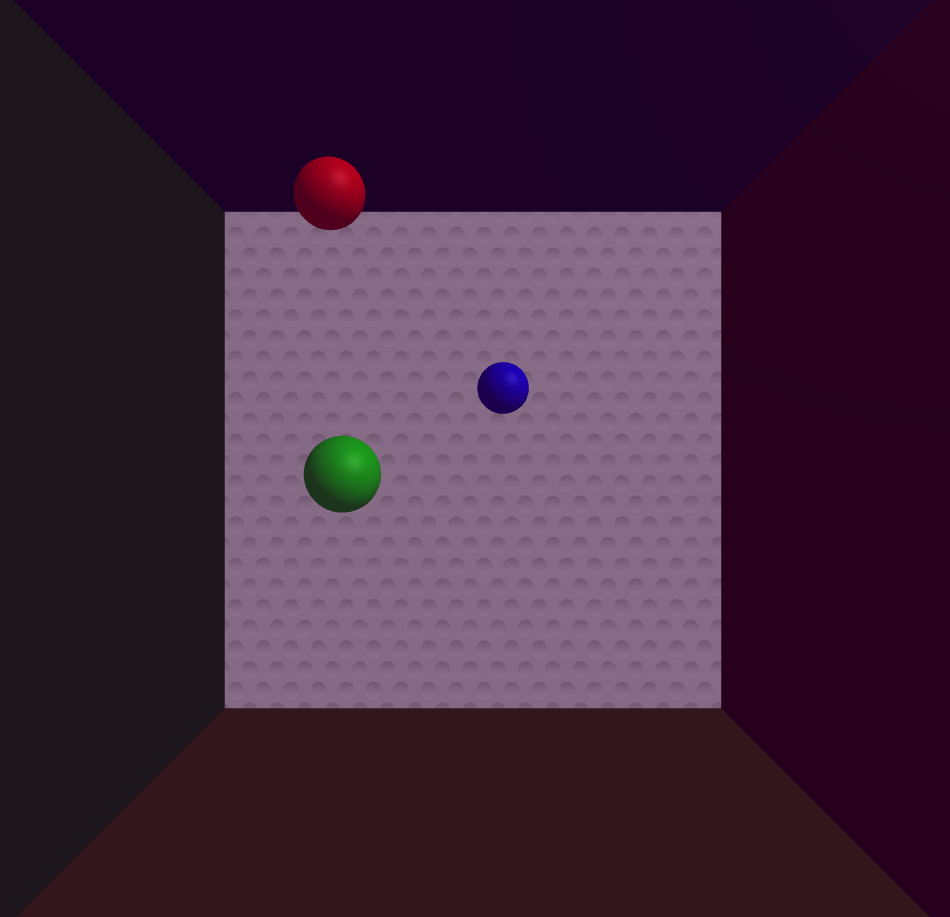

|    NRP     |      Name      |
| :--------: | :------------: |
| 5025221195 | Ahmad Fadhilah Mappisara |

# WebGL Bouncing Spheres Project

Proyek ini mendemonstrasikan penggunaan WebGL dan Three.js untuk membuat animasi 3D interaktif di browser. Animasi ini menampilkan tiga bola berwarna yang bergerak dan memantul di dalam ruangan dengan dinding berwarna semi-transparan.

## Fitur

- Tiga bola berwarna (merah, hijau, biru) yang bergerak secara independen
- Dinding berwarna semi-transparan yang membentuk ruangan tertutup
- Deteksi tumbukan dan pantulan realistis antar bola dan dinding
- Tampilan layar penuh yang responsif

## Tampilan

Jika dijalankan, proyek ini akan menampilkan sebuah scene 3D dengan karakteristik sebagai berikut:

- Latar belakang hitam
- Enam dinding berwarna berbeda (merah, hijau, biru, kuning, magenta, cyan) yang membentuk sebuah kubus
- Tiga bola berwarna (merah, hijau, biru) yang bergerak dan memantul di dalam kubus
- Dinding-dinding tersebut semi-transparan, sehingga Anda dapat melihat bola-bola melalui dinding

Bola-bola akan bergerak secara kontinu, memantul ketika menabrak dinding atau bola lainnya. Gerakan dan pantulan akan terlihat halus dan realistis.

## Cara Penggunaan

1. Clone repository ini ke komputer lokal Anda.
2. Buka file `index.html` di browser web modern (Chrome, Firefox, Safari, Edge).
3. Anda akan melihat animasi berjalan secara otomatis dalam tampilan layar penuh.
4. Untuk keluar dari mode layar penuh, tekan tombol `Esc` pada keyboard Anda.

## Teknologi yang Digunakan

- HTML5
- CSS3
- JavaScript
- WebGL
- Three.js

